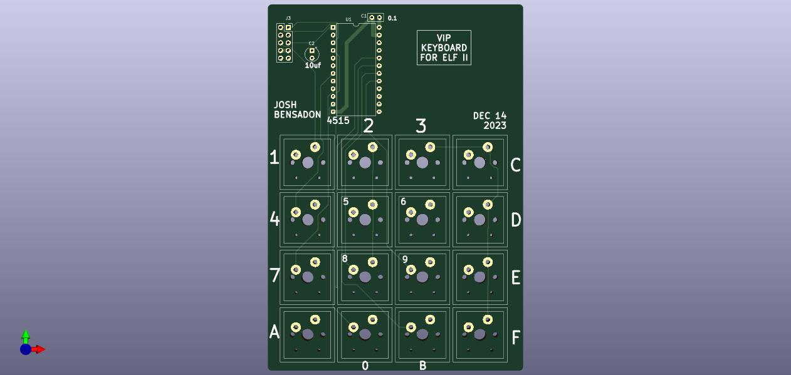
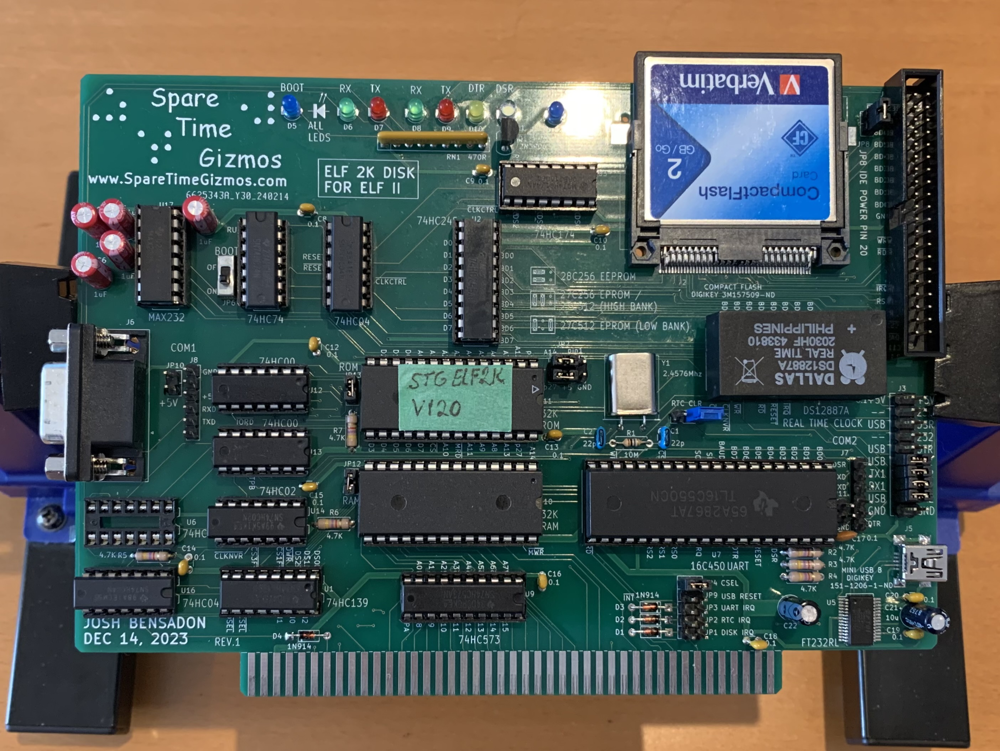

# AVI ELF II Rev D Variant

**The AVI ELF II Rev D Variant is a reproduction of the RCA  CDP1802-based computer kit by Netronics Research and Development Limited.**

The AVI ELF II Rev D Variant single board microcomputer is a replica of the Netronics ELF II microcomputer that was reimagined by the late Ed Keefe (1964-2022) to maintain the aesthetic of the original ELF II, with additional onboard RAM and daughter cards for flexibility of keypad encoders and display drivers.

This project is ongoing with the support of [Josh Bensadon](https://github.com/JoshBensadon), [Andrew Wasson](https://github.com/awasson), Walter Miraglia, Costas Skordis and Rizal Acob. Below you will find a stable version of the PCB gerber files, bill of materials. 

[The Assembly Manual](https://github.com/awasson/AVI-ELF-II/wiki/AVI-ELF-II-Detailed-Assembly-Notes) is in the Wiki.

**There are a number of differences between the AVI ELF II and the original:**

* Power on/off toggle switch with power status LED.
* Power is from a single 6 to 9 volt DC supply that supplies the board and expansion cards. Suitable for use with typical 9 volt adapter with barrel connector (center positive). If a V7805-2000R (DC DC CONVERTER 5V 10W) is used in place of the LM7805 voltage regulator, up to 2A of current is available for the board and expansion boards.
* Optional on-board DC-DC coverter for +8 volt / -8 volt supply for original Netronics Giant Board.
* 32KB on-board RAM with ability to adjust RAM size from 256 Bytes to 32KB.
* Optional onboard RAM battery backup.
* Keypad uses modern Cherry MX compatible keyswitches.
* Optional raised Keypad to approximate height of keypad on the original Netronics ELF II.
* Onboard Data Display options for original HP 5082-7740 7-Segment Displays or HP 5082-7340 Dot Matrix LED Display.
* Optional raised display boards for TIL 311 or Dot Matrix Address and Data Displays. 

### Build Notes & Assembly Manual
* [Detailed Assembly Notes](https://github.com/awasson/AVI-ELF-II/wiki/AVI-ELF-II-Detailed-Assembly-Notes)

### Design Files:
* [Schematic](notes/ELF-II/AVIELF2v1-Sch.pdf)
* [Bill of Materials](notes/ELF-II/AVI%20ELF%20II%20Final%20BOM.xlsx)
* [FAB Files](gerbers/ELF-II/AVIELF2v1-Gerbers.zip)

## Expansion Boards
Aside from the novelty of having a retro-replica of one of the most sought after Cosmac ELF variants, the fun begins when you add expansion boards to add features and extend the capabilities of the ELF II microcomputer. Several Expansion boards have been designed to enhance and extend the ELF II. These were designed primarily for use with the AVI ELF II but it is quite possible that many will work with an orginal Netronics ELF II. 

* **AVI Hyperboard Expansion Card**\
The Hyperboard is a modern take on the Netronics ELF II Giant Board which includes additional RAM and EEPROM, input/output ports and serial connections with 32KB RAM / 32KB EPROM, CD1852 Byte-Wide Input/Output Ports, CD1854 UART, Cassette IN/OUT with proto area.\
\
\
\
If the goal for your AVI ELF II is a fully expanded period computer from the late 1970's, the Hyperboard is a good addition to begin with. The Hyperboard will run new firmware readily and also runs period software including the Netronics Giant Monitor for automating entry, inspection and running programs. The Hyperboard also enables loading and saving programs from cassete tape.
   * [Get the schematics here](notes/Hyperboard/AVIELF2HYPERBOARD-SCH.pdf)
   * [Get the Gerber Files here](gerbers/Hyperboard/AVIELF2HYPERBOARD-Gerbers.zip)
   * [Build Notes and Assembly Manual](https://github.com/awasson/AVI-ELF-II/wiki/AVI-Hyperboard-Expansion-Card-Assembly-Notes)

* **ELF II SD Card**\
With 128K RAM, 32K EEPROM, TTL and Serial terminal connections and an SD Card for storage, the ELF II SD Card board provides the electronics and software to turn your AVI ELF II into a powerful RCA VIP compatible machine that is capable of reading, loading and running your software library of VIP and Chip8 programs just like the original RCA VIP.\
\
**Note:** For full VIP compatibility, the VIP Keyboard For ELF II described below is required.\
\

   * [Get the schematics here](notes/AVIELF2SD/AVIELF2SD-SCH.pdf)
   * [Get the Gerber Files here](gerbers/AVIELF2SD/AVIELF2SD-Gerbers.zip)
   * [Build Notes and Assembly Manual](https://github.com/awasson/AVI-ELF-II/wiki/ELF-II-SD-Card-Detailed-Assembly-Notes)
 
* **VIP Keyboard For ELF II**\
The VIP Keyboard for ELF II is the companion card for the ELF II SD Card described above, providing the correct keyboard orientation and mapping for the RCA VIP system with a Q LED and a micro speaker to play the beeps tones and notifications that the original VIP plays.\
\
\
   * [Get the schematics here](notes/AVIELF2-VIP/AVIELF2-VIP-SCH.pdf)
   * [Get the Gerber Files here](gerbers/AVIELF2-VIP/AVIELF2-VIP-Gerbers.zip)
   * [Build Notes and Assembly Manual](https://github.com/awasson/AVI-ELF-II/wiki/VIP-Keyboard-for-The-AVI-ELF-II-Board-Assembly-Notes)
 
* **VIP Secondary Keyboard for ELF II**\
For use with VIP Keyboard for ELF II as shown above for multiplayer game support.\
\

   * [Get the schematics here](notes/AVIELF2-VIP/AVIELF2-VIP2-SCH.pdf)
   * [Get the Gerber Files here](gerbers/AVIELF2-VIP/AVIELF2-VIP2-Gerbers.zip)
   * [Build Notes and Assembly Manual](https://github.com/awasson/AVI-ELF-II/wiki/VIP-Secondary-Keyboard-for-The-AVI-ELF-II-Board-Assembly-Notes)

* **Protoboard**\
Full sized expansion card with 86 position edge connection for prototyping cicuitry.\
\

   * [Get the Gerber Files here](gerbers/AVIELF2Prototyping/AVIELF2Prototyping-Gerbers.zip). 

* **ELF II LED Matrix Display**\
A plugin display board that is located directly in front of the Hex keypad, replacing the original LED data display to provide an updated, larger, dot matrix display with 4 digit address and 2 digit data, plus additional messaging to indicate load mode and reset.\
\
\
   * [Get the schematics here](notes/AVIELF2DISPLAYMAX7219/AVIELF2DISPLAYMAX7219-SCH.pdf) 
   * [Get the Gerber Files here](gerbers/AVIELF2DISPLAYMAX7219/AVIELF2DISPLAYMAX7219-Gerbers.zip)
   * [Get the Hex file for programming the Two PIC 16F1826 Chips](notes/AVIELF2DISPLAYMAX7219/HexDisp.HEX)
   * [Build Notes and Assembly Manual](https://github.com/awasson/AVI-ELF-II/wiki/ELF-II-LED-Matrix-Display-Assembly-Notes)

* **STG ELF 2K Disk for ELF II Card**\
Uses Spare Time Gizmos ELF 2K Firmware to add a Compact Flash Card "Hard Disk" to use with the ELF/OS Disk Operating System. Provides 32KB RAM / 32KB EPROM, 16C450 UART, Serial Communications with FTDI connections, USB FT232RL device, IDE connection, CF Card socket and Real Time Clock chip (Assembly Instructions in progress).\
\
\
\
If the goal for your AVI ELF II is to have a retro-modern 1802 system capable of running the ELF/OS disk operating system, using a compact flash card as a hard drive with a RS232 Serial connection up to BAUD 19200 and a real time clock, the ELF 2K for ELF II card covers all of the bases to get you there and the STG firmware provides additional system tools and programming languages. 
   * [Get the schematics here](notes/AVIELFSTGDISK0/AVIELFSTGDISK0-SCH.pdf)
   * [Get the Gerber Files here](gerbers/AVIELFSTGDISK0/AVIELFSTGDISK0-Gerbers.zip)
   * [Build Notes and Assembly Manual](https://github.com/awasson/AVI-ELF-II/wiki/STG-ELF-2K-Disk-for-ELF-II-Card-Assembly-Notes)
